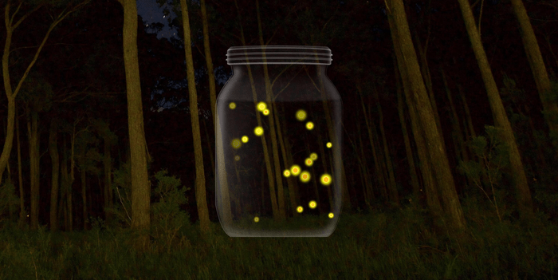

# Fireflies

## :sparkles: About

This is a small project created during week 2 of MIT xPro's full stack development program, while practicing the basics of JavaScript animation with edge detection and simple DOM manipulation. 

## :sparkles: How to use

Save each file to a folder on your local machine. I've added a few quick comments in the JS file to help explain each function's purpose. 

> To change how many fireflies float in the jar, change the condition of the for loop at the very bottom to your desired number. Currently it's set to 23.

## :sparkles: Resources

Free, no attribution licensed images from pexels.com